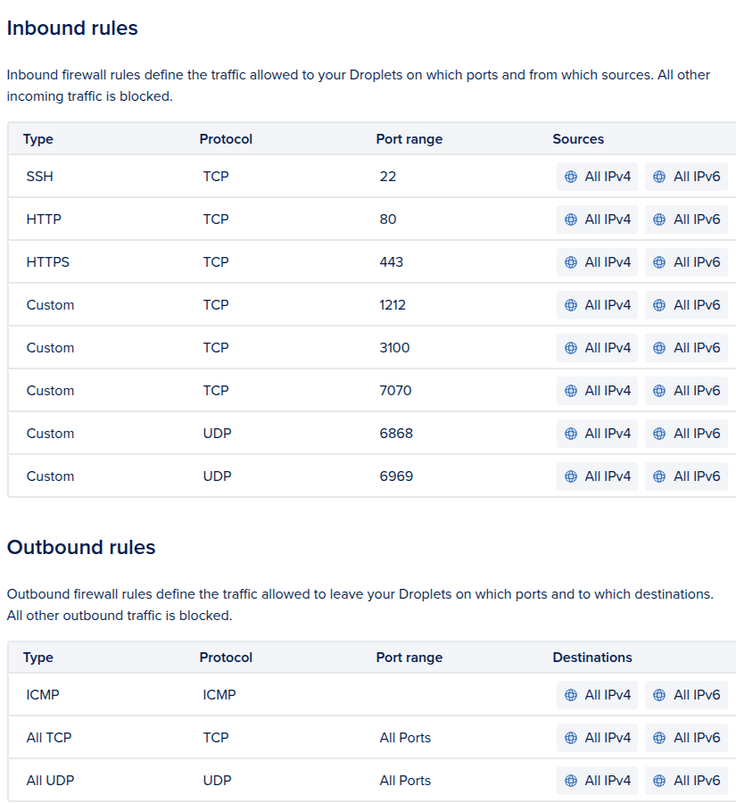

# Firewall

We are using a Digital Ocean Firewall.

## Inbound Rules

| Type   | Protocol | Port Range | Sources            |
| ------ | -------- | ---------- | ------------------ |
| SSH    | TCP      | 22         | All IPv4, All IPv6 |
| HTTP   | TCP      | 80         | All IPv4, All IPv6 |
| HTTPS  | TCP      | 443        | All IPv4, All IPv6 |
| Custom | TCP      | 1212       | All IPv4, All IPv6 |
| Custom | TCP      | 3100       | All IPv4, All IPv6 |
| Custom | TCP      | 7070       | All IPv4, All IPv6 |
| Custom | UDP      | 6868       | All IPv4, All IPv6 |
| Custom | UDP      | 6969       | All IPv4, All IPv6 |

### Port Reference

| Port | Service      | Protocol | Purpose                      |
| ---- | ------------ | -------- | ---------------------------- |
| 22   | SSH          | TCP      | Secure shell access          |
| 80   | HTTP         | TCP      | HTTP (redirects to HTTPS)    |
| 443  | HTTPS        | TCP      | HTTPS (main web traffic)     |
| 1212 | Tracker API  | TCP      | Tracker admin API            |
| 3100 | Grafana      | TCP      | Monitoring dashboard         |
| 7070 | HTTP Tracker | TCP      | HTTP tracker announces       |
| 6868 | UDP Tracker  | UDP      | UDP tracker announces        |
| 6969 | UDP Tracker  | UDP      | UDP tracker announces (main) |

> **Warning**: Port 80 is not permanently enabled in the firewall. It needs to be temporarily opened when renewing Let's Encrypt certificates.

## Outbound Rules

| Type    | Protocol | Port Range | Destinations       |
| ------- | -------- | ---------- | ------------------ |
| ICMP    | ICMP     |            | All IPv4, All IPv6 |
| All TCP | TCP      | All Ports  | All IPv4, All IPv6 |
| All UDP | UDP      | All Ports  | All IPv4, All IPv6 |

## Security Notes

This is especially important for Prometheus service because it does not have authentication. This should not be exposed:

<http://grafana.torrust-demo.com:9090>
